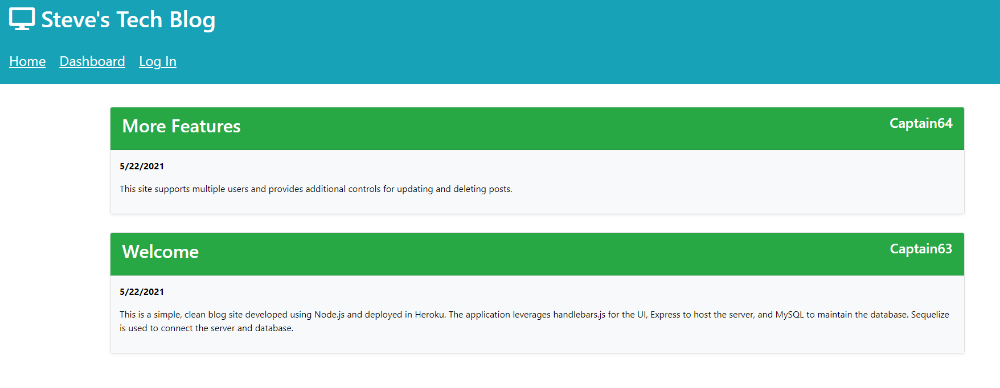
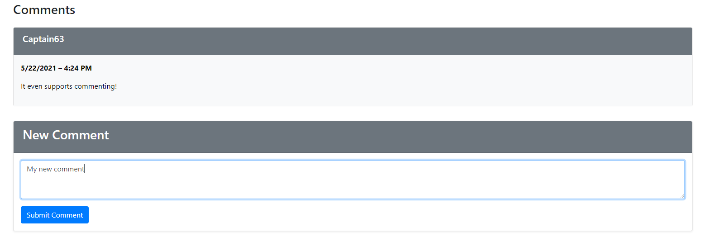
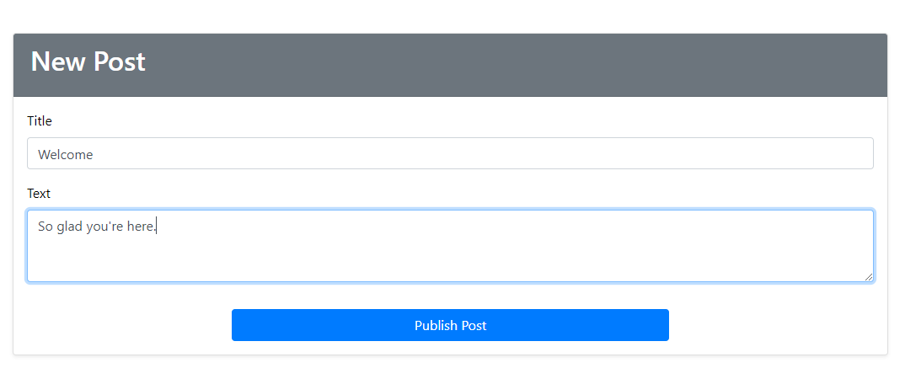
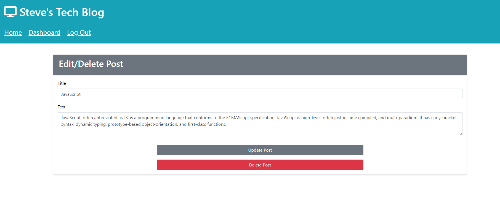

# Steve's Tech Blog


## Table of Contents
- [Project Overview](#project-overview) 
- [Live Application](#live-application)
- [Installation](#installation)
- [License](#license)
- [Screenshots](#screenshots)

## Project Overview
Blog content management system for users to write blog posts and post comments. Applicaiton follows the MVC paradigm and is built using Handlebars and Bootstrap for the front end, Node.js and Express for the server and API, Sequelize as the ODM, and MySQL for the database. All data is hosted in MySQL database on Heroku, including authentication for creating accounts and signing in users to ensure that only those with an assigned username and credentials can add posts or comments. User is able to update and delete their existing posts.

Tech Blog is a progressive web application so the user can install the app on their local machine.

[View the live application](https://stephentechblog.com/) in Heroku.

### Languages Used
- JavaScript (Node.js)
- SQL (MySQL)
- HTML (Handlebars.js)
- CSS (Bootstrap & custom CSS)

### Node Libraries Used
- [MySQL](https://www.npmjs.com/package/mysql)
- [Sequelize](https://www.npmjs.com/package/sequelize)
- [Express](https://www.npmjs.com/package/express)
- [Express Handlebars](https://www.npmjs.com/package/express-handlebars)
- [Bcrypt](https://www.npmjs.com/package/bcrypt)
- [Dotenv](https://www.npmjs.com/package/dotenv)

See [package.json](./package.json) for full list of dependencies.

### Additional Libraries
- [Bootstrap](https://getbootstrap.com/)
- [Font Awesome](https://fontawesome.com/)

## Live Application
[View application deployment](https://stephentechblog.com/) in Heroku.

## Installation
To run this application on your local machine, Node.js is _required_. Once cloned/downloaded from GitHub, enter ```npm i``` in command line to install the packages referenced under Libraries Used automatically. 

Then, update [.env.EXAMPLE](./.env.EXAMPLE) to hold your specific SQL credentials and database information so that the server.js file can connect to the server and update file name to .env. 

Then, create the SQL database by running the commands in [schema.sql](./db/schema.sql). Next, seed the data by entering ```npm run seed``` in command line to add test data to the database. You should now be ready to launch the application by entering ```npm start```.


## License
Permission is hereby granted, free of charge, to any person obtaining a copy of this Software and associated documentation files (the "Software"), to deal in the Software without  restriction, including without limitation the rights to use, copy, modify, merge, publish distribute, sublicense, and/or sell copies of the Software, and to permit persons to whom the Software is furnished to do so, subject to the following conditions.

[View the full license](./LICENSE)

## Screenshots








